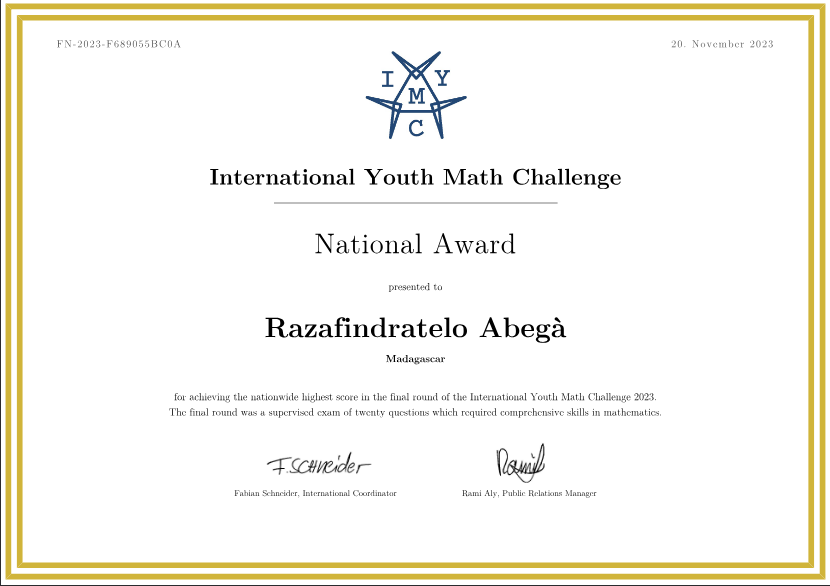
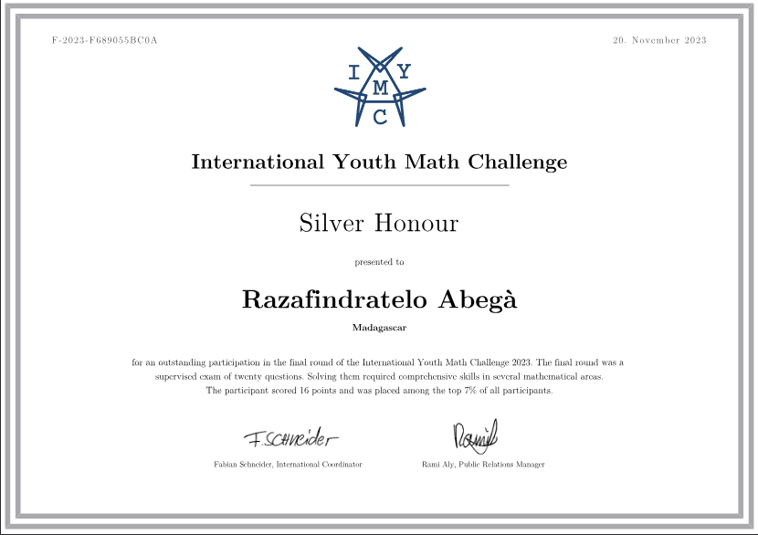

<!-- Animated Header -->

  

  

 

 

 

---
## Certifications & Distinctions

 

**Technical Certifications**

&nbsp;

&nbsp;

&nbsp;

&nbsp;

[-2496ED?style=flat-square&logo=docker&logoColor=white)](https://drive.google.com/drive/folders/1SNceOnJ24znLNjcHO446qyjo08QkKLYv?usp=drive_link)
&nbsp;

 

**Competitions & Awards**

&nbsp;

&nbsp;

 

---
## 🖼️ Certificates Showcase

### 🇲🇬 National Award of Madagascar, 2023 - International Youth Math Challenge

  

### 🥈 Silver Honor – IYMC, 2023 - International Youth Math Challenge

---

## 🎓 Academic Distinction

### 🥇 Valedictorian — Mathematics (2023–2024)
**University of Antananarivo, Department of Mathematics and Computer Science — _With Distinction_**

 

**Achievement:**  
In my first year studying Mathematics at the University of Antananarivo, I pursued a second program simultaneously in Computer Science at Haute École d’Informatique. Among ~300 students, I earned the **highest overall grade across both semesters**, being recognized as **Valedictorian with Distinction** (December 2024). This reflects strong academic performance across two rigorous programs.

 

  

### 🎓 Excellence Scholarship — Top Performer in Entrance Exam (Oct 2023)
**Haute École d’Informatique (HEI)**

**Achievement:**  
The Computer Science program at Haute École d’Informatique requires a competitive entrance exam. I achieved the **highest score among all candidates**, earning the **Excellence Scholarship**, which covers full tuition for the academic year. This award recognizes exceptional academic potential and top performance in a highly selective process.

 

---

## 📊 GitHub Analytics

<!-- Stats Grid -->

 
 

<!-- Activity Graph -->

 

---

## 🛠️ Tech Stack & Tools

<h2 align="center">🚀 Technical Arsenal 🚀</h2>

	<a href="https://skillicons.dev">
		
     
    
     
	
	 
	
	</a>

 

---

## 📚 Philosophy & Inspiration

> *"Wir müssen wissen. Wir werden wissen."*  
> *"Nothing big is done without pain."*  
> *"Create yourself."*  
> *"The best way to predict the future is to invent it." – Alan Kay*

 

---

## 🤝 Let's Collaborate & Connect

### 🚀 Collaboration Opportunities

 

### 📫 Connect With Me

 

### 🌟 Motto / Inspiration

> *"From abstract mathematics to concrete code – building the future one algorithm at a time."*

