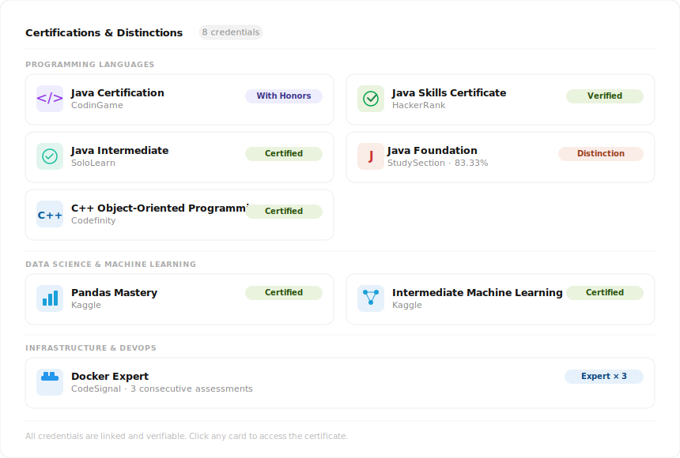
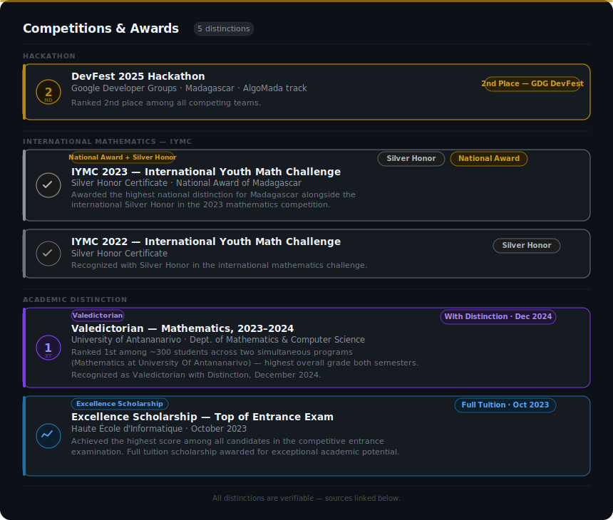
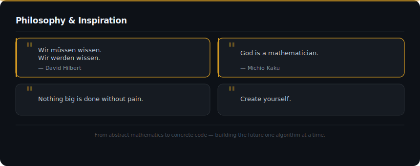
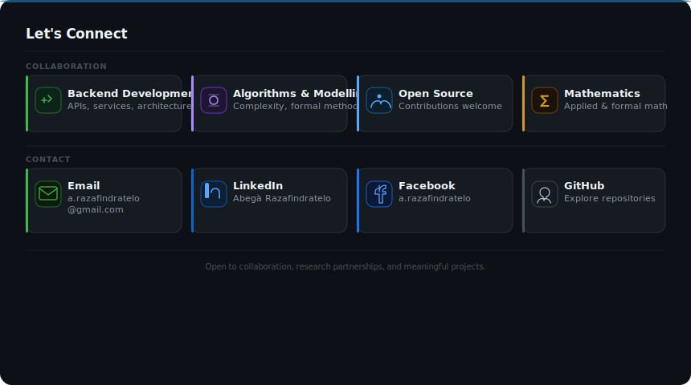

<!-- Animated Header -->

  

  

 

 

 

---
## Certifications & Distinctions

 

 

## Competitions & Awards

 

**Sources & Verification**

| | Distinction | Link |
|---|---|---|
| DevFest 2025 | 2nd Place — GDG Hackathon | [LinkedIn Announcement](https://www.linkedin.com/posts/abeg%C3%A0-razafindratelo_devfest-algomada-devfest-activity-7403757196502769664-SldB) |
| IYMC 2023 | Silver Honor + National Award | [Official IYMC Results](https://iymc.info/en/announcement2023) · [Certificate](https://drive.google.com/file/d/1m_WmGCfXViMGUjvEdnsqX3qIVKvQN74L/view?usp=drive_link) |
| IYMC 2022 | Silver Honor | [Certificate](https://drive.google.com/file/d/1L1MgDJfAx_kYMfAThdNhv75gdkptpX5g/view?usp=drive_link)
---

## 📊 GitHub Analytics

<!-- Stats Grid -->

 
 

<!-- Activity Graph -->

 

---
## Tech Stack & Tools

 

**Languages**

<table>
  <tr>
    <td align="center" width="80"> Java</td>
    <td align="center" width="80"> Python</td>
    <td align="center" width="80"> C</td>
    <td align="center" width="80"> C++</td>
    <td align="center" width="80"> JavaScript</td>
    <td align="center" width="80"> TypeScript</td>
    <td align="center" width="80"> LaTeX</td>
    <td align="center" width="80"> PostgreSQL</td>
  </tr>
</table>

 

**Frameworks & Libraries**

<table>
  <tr>
    <td align="center" width="80"> Spring</td>
    <td align="center" width="80"> Maven</td>
    <td align="center" width="80"> CMake</td>
    <td align="center" width="80"> React</td>
    <td align="center" width="80"> Next.js</td>
    <td align="center" width="80"> HTML</td>
    <td align="center" width="80"> CSS</td>
    <td align="center" width="80"> Tailwind</td>
    <td align="center" width="80"> Scikit-learn</td>
    <td align="center" width="80"> npm</td>
  </tr>
</table>

 

**DevOps & Infrastructure**

<table>
  <tr>
    <td align="center" width="80"> GitHub</td>
    <td align="center" width="80"> Git</td>
    <td align="center" width="80"> Linux</td>
    <td align="center" width="80"> Debian</td>
    <td align="center" width="80"> Docker</td>
    <td align="center" width="80"> Postman</td>
    <td align="center" width="80"> AWS</td>
  </tr>
</table>

 

**Editors & IDEs**

<table>
  <tr>
    <td align="center" width="80"> CLion</td>
    <td align="center" width="80"> IntelliJ IDEA</td>
    <td align="center" width="80"> PyCharm</td>
    <td align="center" width="80"> VS Code</td>
    <td align="center" width="80"> Sublime Text</td>
  </tr>
</table>

 

---
## Philosophy & Inspiration

 

## Let's Connect

