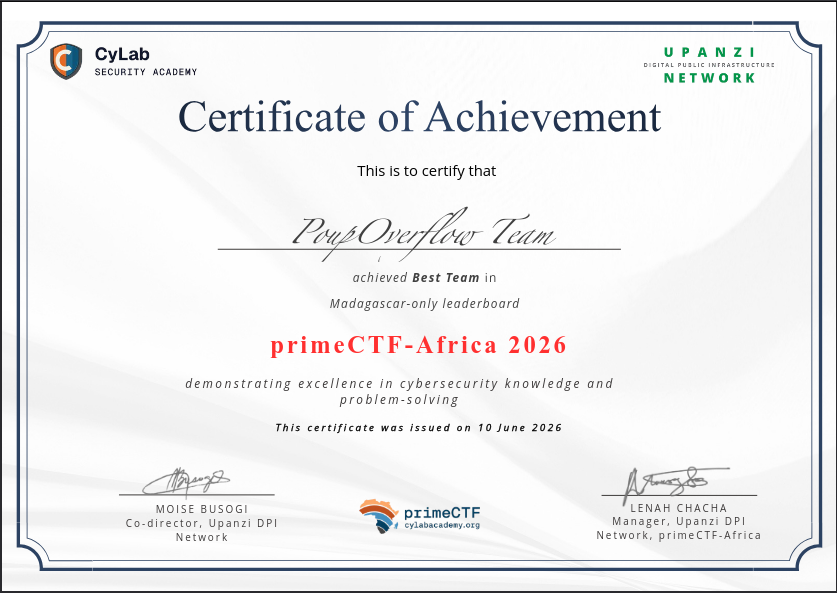

 

 

 

 

 

---

### COMPETITIONS & AWARDS

 

<table>
<tr>
<td width="60" align="center"></td>
<td><strong>2nd Place &mdash; DevFest 2025 Hackathon</strong> Google Developer Groups &middot; Madagascar &middot; AlgoMada track</td>
<td align="right"></td>
</tr>
<tr>
<td width="60" align="center"></td>
<td><strong>Best Team (Madagascar) &mdash; primeCTF Africa 2026</strong> CyLab Security Academy &middot; Upanzi DPI Network &middot; PoupOverflow Team &middot; June 2026</td>
<td align="right"></td>
</tr>
<tr>
<td width="60" align="center"></td>
<td><strong>Silver Honor + National Award &mdash; IYMC 2023</strong> International Youth Math Challenge &middot; Top 7% worldwide &middot; Highest score in Madagascar</td>
<td align="right">

&nbsp;

</td>
</tr>
<tr>
<td width="60" align="center"></td>
<td><strong>Silver Honor &mdash; IYMC 2022</strong> International Youth Math Challenge</td>
<td align="right"></td>
</tr>
<tr>
<td width="60" align="center"></td>
<td><strong>Valedictorian &mdash; Mathematics 2023&ndash;2024</strong> University of Antananarivo &middot; Ranked 1st among ~300 students &middot; With Distinction &middot; Dec 2024</td>
<td align="right"></td>
</tr>
<tr>
<td width="60" align="center"></td>
<td><strong>Excellence Scholarship &mdash; HEI Entrance Exam</strong> Haute &Eacute;cole d&rsquo;Informatique &middot; Highest score among all candidates &middot; Full tuition &middot; Oct 2023</td>
<td align="right"></td>
</tr>
</table>

 

---

### CERTIFICATIONS

 

**Programming Languages**

<table>
<tr>
<td width="52" align="center"></td>
<td><strong>Java Certification</strong> CodinGame</td>
<td></td>
</tr>
<tr>
<td width="52" align="center"></td>
<td><strong>Java Skills Certificate</strong> HackerRank</td>
<td></td>
</tr>
<tr>
<td width="52" align="center"></td>
<td><strong>Java Intermediate</strong> SoloLearn</td>
<td></td>
</tr>
<tr>
<td width="52" align="center"></td>
<td><strong>Java Foundation &mdash; 83.33%</strong> StudySection</td>
<td></td>
</tr>
<tr>
<td width="52" align="center"></td>
<td><strong>C++ Object-Oriented Programming</strong> Codefinity</td>
<td></td>
</tr>
</table>

 

**Data Science & Machine Learning**

<table>
<tr>
<td width="52" align="center"></td>
<td><strong>Pandas Mastery</strong> Kaggle</td>
<td></td>
</tr>
<tr>
<td width="52" align="center"></td>
<td><strong>Intermediate Machine Learning</strong> Kaggle</td>
<td></td>
</tr>
</table>

 

**Infrastructure & DevOps**

<table>
<tr>
<td width="52" align="center"></td>
<td><strong>Docker Expert &mdash; 3 consecutive assessments</strong> CodeSignal</td>
<td>&nbsp;<strong>Expert &times; 3</strong></td>
</tr>
</table>

 

---

### CERTIFICATE SHOWCASE

 

<table>
<tr>
<td align="center" width="50%">
<strong>National Award of Madagascar &mdash; IYMC 2023</strong> 
Highest national score in the final round  

</td>
<td align="center" width="50%">
<strong>Silver Honor &mdash; IYMC 2023</strong> 
Top 7% worldwide &middot; 16 points in the final round  

</td>
</tr>
<tr>
<td align="center" colspan="2">
<strong>Best Team (Madagascar) &mdash; primeCTF Africa 2026</strong> 
CyLab Security Academy &middot; Upanzi DPI Network &middot; PoupOverflow Team &middot; June 10, 2026  

</td>
</tr>
</table>

 

---

### GITHUB ANALYTICS

 

 
 

<!-- Activity Graph -->

 

---

### TECH STACK

 

**Languages**

 

**Frameworks & Libraries**

 

**DevOps & Infrastructure**

 

**Editors & IDEs**

 

---

### PHILOSOPHY & INSPIRATION

 

<table>
<tr>
<td align="center" width="50%">
  
<em>"Wir müssen wissen. Wir werden wissen."</em> 
&mdash; David Hilbert
  
</td>
<td align="center" width="50%">
  
<em>"God is a mathematician."</em> 
&mdash; Michio Kaku
  
</td>
</tr>
<tr>
<td align="center" width="50%">
  
<em>"Nothing big is done without pain."</em>
  
</td>
<td align="center" width="50%">
  
<em>"Create yourself."</em>
  
</td>
</tr>
</table>

 

*From abstract mathematics to concrete code &mdash; building the future one algorithm at a time.*

 

---

### LET'S CONNECT

 

**Open to:** Backend Development &middot; Algorithms & Modelling &middot; Open Source &middot; Applied Mathematics

 

<table>
<tr>
<td align="center">
<a href="mailto:a.razafindratelo@gmail.com">
 
Email
</a>
</td>
<td align="center">
<a href="https://www.linkedin.com/in/abeg%C3%A0-razafindratelo">
 
LinkedIn
</a>
</td>
<td align="center">
<a href="https://github.com/Abega1642">
 
GitHub
</a>
</td>
<td align="center">
<a href="https://www.facebook.com/a.razafindratelo/">
 
Facebook
</a>
</td>
</tr>
</table>

 

